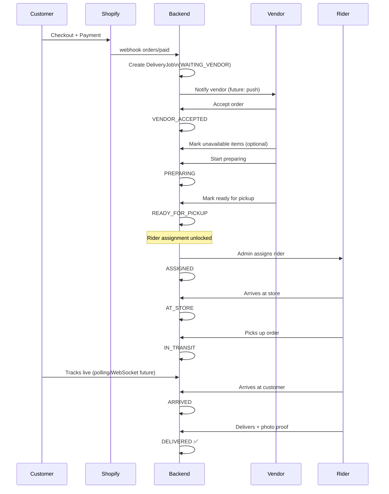
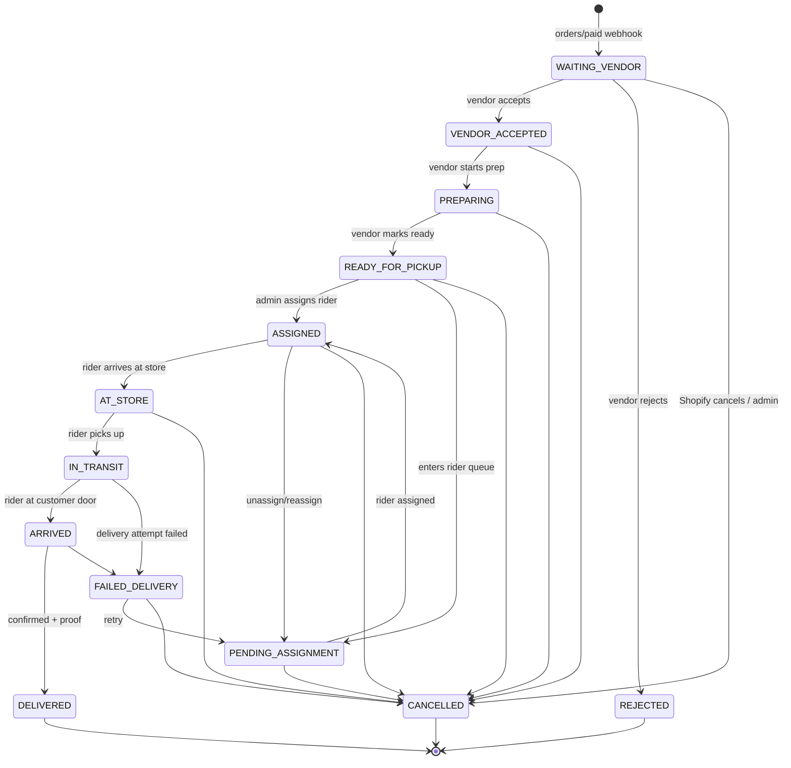

# NOW KART — BUSINESS WORKFLOW

→ See [`SYSTEM_ARCHITECTURE.md`](SYSTEM_ARCHITECTURE.md) for system context.

---

## Order Lifecycle

---

## Delivery Job State Machine

### State Labels (shown in UI)

| Status | Customer Label | Internal |
|---|---|---|
| `waiting_vendor` | Waiting for Vendor | WAITING_VENDOR |
| `vendor_accepted` | Vendor Accepted | VENDOR_ACCEPTED |
| `preparing` | Preparing Order | PREPARING |
| `ready_for_pickup` | Ready for Pickup | READY_FOR_PICKUP |
| `pending_assignment` | Awaiting Rider | PENDING_ASSIGNMENT |
| `assigned` | Rider Assigned | ASSIGNED |
| `at_store` | Rider at Store | AT_STORE |
| `in_transit` | Out for Delivery | IN_TRANSIT |
| `arrived` | Rider Arrived | ARRIVED |
| `delivered` | Delivered ✅ | DELIVERED (terminal) |
| `failed_delivery` | Delivery Failed | FAILED_DELIVERY |
| `cancelled` | Cancelled | CANCELLED (terminal) |
| `rejected` | Order Rejected | REJECTED (terminal) |

---

## Vendor Flow

1. Vendor logs in → sets status **OPEN**
2. New order arrives in queue (`WAITING_VENDOR`)
3. Vendor reviews items → **accepts** or **rejects** (with reason)
4. Vendor marks any unavailable items (stored on delivery job)
5. Vendor taps **Start Preparing** → `PREPARING`
6. Vendor taps **Ready for Pickup** → `READY_FOR_PICKUP`
7. Admin dashboard shows job as assignable

> Rider assignment is **blocked** until `READY_FOR_PICKUP` or `PENDING_ASSIGNMENT`.

---

## Rider Flow

1. Rider logs in → sets status **ONLINE**
2. Admin assigns job → status `ASSIGNED`, rider → BUSY
3. Rider navigates to store (deep-link to Google Maps / Apple Maps)
4. Rider marks **At Store** → `AT_STORE`
5. Rider collects order → marks **Picked Up** → `IN_TRANSIT`
6. Rider navigates to customer
7. Rider marks **Arrived** → `ARRIVED`
8. Rider takes mandatory proof photo → marks **Delivered** → `DELIVERED`
9. Rider status returns to ONLINE

---

## Cancellation Rules

| Status at Cancellation | Behaviour |
|---|---|
| `WAITING_VENDOR` | Auto-cancel. Notify vendor. |
| `VENDOR_ACCEPTED`, `PREPARING`, `READY_FOR_PICKUP` | Auto-cancel. Notify vendor. |
| `ASSIGNED` | Auto-cancel. Notify rider. |
| `AT_STORE` | Auto-cancel. Notify rider. |
| `IN_TRANSIT` | **NOT auto-cancelled.** Alert event added. Admin must intervene. |
| `DELIVERED`, `CANCELLED`, `REJECTED` | Terminal — no further transitions. |

---

## Shopify Webhook Topics Handled

| Topic | Action |
|---|---|
| `orders/paid` | Create delivery job (`WAITING_VENDOR`) + link vendor from store |
| `orders/cancelled` | Cancel delivery job (except IN_TRANSIT — alert only) |

> Webhook idempotency key: `X-Shopify-Webhook-Id` stored in `webhook_events` collection.

---

## Future Workflows (placeholders — not implemented)

- **Auto-assignment**: proximity-based rider selection using MongoDB 2dsphere index
- **Live GPS tracking**: Redis pub/sub + WebSocket fan-out to Customer App
- **Dynamic ETA**: Google Distance Matrix API, server-side, cached 90s
- **Push notifications**: Expo Push / FCM on every state transition
- **Rejected order refunds**: Shopify Admin API call from admin module
