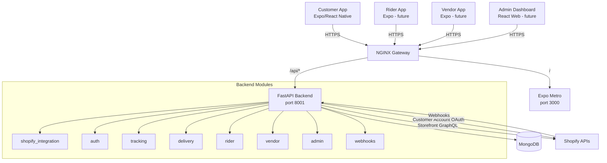
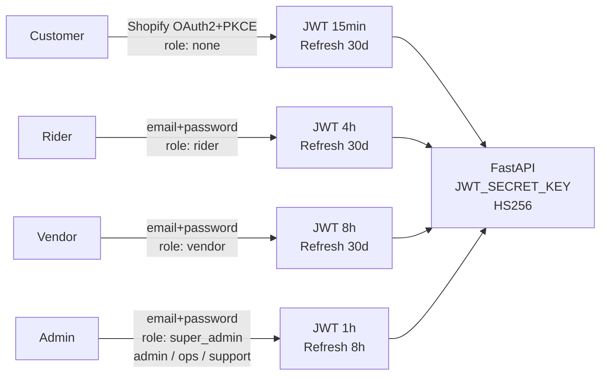

# NOW KART — SYSTEM ARCHITECTURE

→ See [`PROJECT_PLAYBOOK.md`](PROJECT_PLAYBOOK.md) for overview.

---

## Platform Topology



---

## Backend Module Map

| Module | Prefix | Owns | Dependencies |
|---|---|---|---|
| `shopify_integration` | `/api/shopify` | Catalog, cart, checkout | — |
| `auth` | `/api/auth` | Customer OAuth sessions, addresses | shopify_integration |
| `tracking` | `/api/tracking` | Shopify-derived order tracking | auth |
| `delivery` | `/api/delivery` | Delivery job lifecycle, stores | auth, rider, vendor (lazy) |
| `rider` | `/api/rider` | Rider auth, status, job ops | delivery (lazy) |
| `vendor` | `/api/vendor` | Vendor auth, order queue ops | delivery (lazy) |
| `admin` | `/api/admin` | Admin auth, RBAC, dashboard | delivery, rider, vendor, stores |
| `webhooks` | `/api/webhooks` | Shopify event ingestion | delivery |

> **One-directional imports only.** No circular dependencies. Lazy imports (inside functions) used for cross-module references.

---

## Authentication Architecture



| Actor | Role Claim | Isolation Mechanism |
|---|---|---|
| Customer | *(none)* | Lookup in `users` collection returns None for non-customer sub |
| Rider | `role="rider"` | `decode_rider_access_token()` rejects tokens without `role="rider"` |
| Vendor | `role="vendor"` | `decode_vendor_access_token()` rejects tokens without `role="vendor"` |
| Admin | `role=<specific>` | `decode_admin_access_token()` accepts any role in `ADMIN_ROLES` set |

**RBAC hierarchy (admin only):** `super_admin(4) > admin(3) > operations_manager(2) > support(1)`

---

## MongoDB Collections

| Collection | Module | Purpose |
|---|---|---|
| `users` | auth | Shopify customer sessions + encrypted Shopify tokens |
| `auth_refresh_tokens` | auth | Customer refresh tokens (SHA-256 hashed) |
| `delivery_jobs` | delivery | Full delivery job lifecycle |
| `stores` | delivery | Store config, address, settings |
| `webhook_events` | webhooks | Shopify webhook audit + idempotency |
| `riders` | rider | Rider profiles, bcrypt passwords |
| `rider_refresh_tokens` | rider | Rider session tokens |
| `vendors` | vendor | Vendor profiles, bcrypt passwords |
| `vendor_refresh_tokens` | vendor | Vendor session tokens |
| `admin_users` | admin | Admin profiles with role, bcrypt passwords |
| `admin_refresh_tokens` | admin | Admin session tokens |
| `audit_logs` | admin | All admin action audit trail |
| `status_checks` | legacy | Scaffold leftover, unused |

> **Never stored in MongoDB:** product data, cart contents, Shopify customer tokens (plaintext), payment data.

---

## Kubernetes Routing

```
/api/*  → FastAPI :8001
/       → Expo Metro :3000
```

> All backend routes must be prefixed with `/api`. Shopify GIDs in endpoints must use `?id=encodeURIComponent(gid)` query params — never path segments (NGINX double-decodes `%2F`).

---

## Frontend Architecture (Customer App)

```
app/_layout.tsx
└── SafeAreaProvider → AuthProvider → WishlistProvider → CartProvider → Stack
    ├── (tabs)/_layout.tsx  ← CustomTabBar
    │   ├── index.tsx           Home
    │   ├── categories.tsx      Categories
    │   └── orders.tsx          Order list
    ├── product/[handle].tsx
    ├── collection/[handle].tsx
    ├── cart.tsx
    ├── search.tsx
    ├── profile.tsx
    ├── wishlist.tsx
    ├── addresses.tsx
    ├── checkout/address.tsx
    ├── checkout/webview.tsx
    ├── checkout/confirmation.tsx
    ├── order/detail.tsx
    ├── order/track.tsx
    └── auth/callback.tsx

src/
├── features/auth/         AuthContext, useShopifySignIn
├── features/cart/         CartContext
├── features/wishlist/     WishlistContext
├── repositories/          productRepository, cartRepository, authRepository,
│                          trackingRepository
├── services/api/          apiClient.ts
├── services/auth/         pkce.ts, sessionToken.ts
├── shared/components/     23 shared UI components
├── theme/                 colors, typography, spacing (design tokens)
├── types/                 product, cart, auth, tracking, category, home
└── utils/storage/         Native/web split abstraction (NEVER bypass)
```
